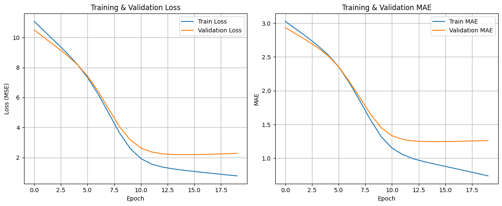

# Sistem Rekomendasi Wisata Jogja
- Author: Faris Nur Rizqiawan
- Platform: Dicoding Submission – Proyek Akhir Machine Learning Terapan
- Domain: Lingkungan
- Metode: Collaborative Filtering (Deep Learning) dan Content-Based Filtering (TF-IDF)

## 1. Project Overview (Ulasan Proyek)

Pariwisata merupakan sektor penting yang mendukung perekonomian dan identitas budaya suatu daerah. Di Daerah Istimewa Yogyakarta, keberagaman objek wisata menjadikannya salah satu tujuan utama wisatawan domestik maupun mancanegara. Namun, dengan banyaknya pilihan tempat wisata, pengguna sering kali kesulitan dalam menentukan tempat mana yang sesuai dengan preferensi dan kebutuhan mereka.

Oleh karena itu, proyek ini bertujuan membangun Sistem Rekomendasi Tempat Wisata di Yogyakarta menggunakan dua pendekatan utama:

1. **Content-Based Filtering** menggunakan TF-IDF dan cosine similarity.
2. **Collaborative Filtering** menggunakan neural network dengan embedding.

**Referensi**:
- Suhailah, Eva, & Hartatik. (2023). Pembuatan sistem rekomendasi pariwisata Yogyakarta menggunakan Triangle Multiplying Jaccard. Jurnal Automation Computer Information System. [Jurnal](https://jacis.pubmedia.id/index.php/jacis/article/view/62/50)
- Nugroho, R.A. et al. (2020). Tourism Site Recommender System Using Item-Based Collaborative Filtering Approach. [Jurnal](https://repository.usd.ac.id/39342/1/6887_Tourism+Site+Recommender+System+Using+Item-Based+Collaborative+Filtering+Approach.pdf)
- Data bersumber dari [Kaggle](https://www.kaggle.com/datasets/farisrizqiawan/dataset-rekomendasi-wisata-jogja).

## 2. Business Understanding

### Problem Statements 
- Bagaimana membangun sistem rekomendasi yang dapat menyarankan tempat wisata di Yogyakarta secara personal, baik berdasarkan deskripsi objek wisata maupun berdasarkan rating dan preferensi pengguna lain?
- Bagaimana cara merekomendasikan tempat wisata yang sesuai preferensi pengguna?
- Bagaimana model dapat mempersonalisasi rekomendasi berdasarkan deskripsi tempat dan interaksi pengguna?

### Goals
- Membangun sistem rekomendasi dengan output Top-N recommendation.
- Meningkatkan relevansi rekomendasi berdasarkan preferensi pengguna.
- Menggunakan dua pendekatan algoritmik yang berbeda untuk memberikan hasil yang komprehensif.

### Solution Approach
1. **Content-Based Filtering**:
   - Menganalisis deskripsi objek wisata untuk merekomendasikan tempat serupa.
   - Menggunakan TF-IDF untuk mengukur kemiripan deskripsi antar destinasi.
2. **Collaborative Filtering**:
   - Menggunakan neural network untuk mempelajari preferensi pengguna berdasarkan interaksi rating.
   - Memprediksi rating untuk user tertentu terhadap objek wisata berdasarkan perilaku pengguna lain.

## 3. Data Understanding

### Sumber dan Jumlah Dataset
- `tourism_jogja.csv`: 437 tempat wisata Yogyakarta.
- `tourism_rating.csv`: 10000 rating pengguna.
- `user.csv`: 300 pengguna.

🔗 Link data: [Kaggle Tourism Rating Dataset](https://www.kaggle.com/datasets/farisrizqiawan/dataset-rekomendasi-wisata-jogja)

### Jumlah dan Kondisi Data
- Tidak terdapat missing value signifikan.
- Tipe data telah sesuai.
- Deskripsi wisata merupakan teks bebas yang akan digunakan dalam TF-IDF.

### Deskripsi Fitur / Variable Perdataset
1. tourism_jogja.csv
   | Atribut       | Tipe Data | Deskripsi                                                              |
   | ------------- | --------- | ---------------------------------------------------------------------- |
   | `place_id`    | Integer   | ID unik untuk tiap tempat wisata.                                      |
   | `name`        | String    | Nama tempat wisata.                                                    |
   | `rating`      | Float     | Rata-rata rating tempat wisata dari berbagai pengguna.                 |
   | `type`        | String    | Jenis tempat wisata berdasarkan karakteristiknya.                      |
   | `htm`         | Integer   | Harga tiket masuk dalam satuan Rupiah.                                 |
   | `latitude`    | Float     | Koordinat lintang lokasi tempat wisata.                                |
   | `longitude`   | Float     | Koordinat bujur lokasi tempat wisata.                                  |
   | `description` | String    | Deskripsi atau informasi singkat tentang tempat wisata.                |

2. rating_tourism.csv
   | Atribut         | Tipe Data | Deskripsi                                                               |
   | --------------- | --------- | ----------------------------------------------------------------------- |
   | `User_Id`       | Integer   | ID unik pengguna yang memberikan rating.                                |
   | `Place_Id`      | Integer   | ID tempat wisata yang dirating.                                         |
   | `Place_Ratings` | Integer   | Nilai rating dari pengguna terhadap tempat wisata (biasanya skala 1–5). |

3. user.csv
   | Atribut    | Tipe Data | Deskripsi                                                   |
   | ---------- | --------- | ----------------------------------------------------------- |
   | `User_Id`  | Integer   | ID unik pengguna.                                           |
   | `Age`      | Integer   | Usia pengguna, digunakan untuk segmentasi berdasarkan umur. |
   | `Location` | String    | Lokasi atau kota asal pengguna, untuk segmentasi geografis. |

### Variable Penting
1. Content-Based Filtering
   | Variabel      | Dataset            | Deskripsi                                                        |
   | ------------- | ------------------ | ---------------------------------------------------------------- |
   | `name`        | tourism\_jogja.csv | Nama tempat wisata yang digunakan untuk mencocokkan konten.      |
   | `description` | tourism\_jogja.csv | Deskripsi tempat wisata sebagai dasar analisis kemiripan konten. |

2. Collaborative Filtering
   | Variabel        | Dataset             | Deskripsi                                                          |
   | --------------- | ------------------- | ------------------------------------------------------------------ |
   | `Place_Ratings` | tourism\_rating.csv | Nilai rating yang diberikan pengguna terhadap suatu tempat wisata. |
   | `User_Id`       | tourism\_rating.csv | ID unik pengguna yang memberikan rating.                           |
   | `Place_Id`      | tourism\_rating.csv | ID tempat wisata yang dirating oleh pengguna.                      |

3. Segmentasi Pengguna
   | Variabel   | Dataset  | Deskripsi                                                        |
   | ---------- | -------- | ---------------------------------------------------------------- |
   | `Age`      | user.csv | Usia pengguna, digunakan untuk segmentasi berdasarkan umur.      |
   | `Location` | user.csv | Lokasi/kota asal pengguna, digunakan untuk segmentasi geografis. |

### Visualisasi dan Insight
1. Distribusi Tempat Wisata Jogja
   
   Hasil visualisasi memberikan pemahaman tentang distribusi rating, harga, jenis wisata, dan sebaran geografis tempat wisata. Ini penting untuk menyusun sistem rekomendasi yang mempertimbangkan preferensi dan keterjangkauan pengguna.

2. Distribusi Rating Wisata
   
   Distribusi rating pengguna cukup merata dengan kecenderungan nilai sedang hingga tinggi. Tempat dengan jumlah rating tertinggi dapat menjadi acuan rekomendasi populer atau baseline rekomendasi bagi pengguna baru.

3. Distribusi User / Pengguna Wisata
   
   Grafik diatas memaparkan demografi pengguna wisata yang meliputi usia dan keberadaan asal pengguna. Informasi ini berguna untuk menyesuaikan sistem rekomendasi agar lebih relevan terhadap kelompok demografi utama yang menggunakan aplikasi.

## 4. Data Preparation

### Langkah yang Dilakukan
1. **Content-Based Filtering**:
   - Menggunakan `TfidfVectorizer` pada `description` tempat wisata.
   - Menghapus *stopwords* menggunakan pustaka Sastrawi.

2. **Collaborative Filtering**:
   - Menggabungkan data rating, user, dan wisata.
   - Menggunakan `LabelEncoder` untuk mengubah `User_Id` dan `Place_Id` menjadi numerik.

### Alasan Data Preparation
- TF-IDF butuh teks bersih untuk menghasilkan representasi yang akurat.
- Label encoding diperlukan karena model deep learning hanya menerima input numerik.

## 5. Modeling and Results

### Content-Based Filtering

#### 1. Arsitektur Model: 

Model ini menggunakan pendekatan Content-Based Filtering untuk merekomendasikan tempat wisata berdasarkan kemiripan deskripsi antar tempat. Arsitektur utamanya terdiri dari tahapan berikut:

   | Tahapan                       | Komponen / Fungsi Python                                            | Penjelasan                                                                                   |
   | ----------------------------- | ------------------------------------------------------------------- | -------------------------------------------------------------------------------------------- |
   | 1. Duplikasi Data             | `tourism_df_pre = tourism_df.copy()`                                | Membuat salinan data utama untuk diproses tanpa mempengaruhi data asli.                      |
   | 2. Stopwords Bahasa Indonesia | `StopWordRemoverFactory` (Sastrawi)                                 | Menghilangkan kata-kata umum/tidak bermakna dari teks deskripsi (misal: *dan*, *yang*).      |
   | 3. Ekstraksi Fitur Teks       | `TfidfVectorizer(stop_words=..., max_features=500)`                 | Mengubah teks deskripsi menjadi vektor numerik menggunakan bobot TF-IDF.                     |
   | 4. Matriks TF-IDF             | `tfidf_matrix = tfidf.fit_transform(tourism_df_pre['description'])` | Matriks representasi numerik dari deskripsi tiap tempat wisata.                              |
   | 5. Pengukuran Kemiripan       | `cosine_sim = cosine_similarity(tfidf_matrix, tfidf_matrix)`        | Mengukur tingkat kemiripan antar tempat berdasarkan deskripsi menggunakan Cosine Similarity. |
   | 6. Pemetaan ke Nama Tempat    | `cosine_sim_df = pd.DataFrame(..., index=..., columns=...)`         | Matriks kemiripan dikonversi ke DataFrame agar dapat dicari berdasarkan nama tempat.         |
   | 7. Fungsi Rekomendasi         | `recommend_places_content_based()`                                  | Mengambil tempat paling mirip dengan input berdasarkan nilai cosine similarity tertinggi.    |

#### 2. Alur Kerja Singkat
- Deskripsi tempat wisata diubah menjadi vektor menggunakan TF-IDF.
- Vektor ini dibandingkan satu sama lain menggunakan Cosine Similarity.
- Sistem menemukan tempat wisata yang paling mirip berdasarkan deskripsi kontennya.
- Rekomendasi diberikan sesuai urutan kemiripan tertinggi.
- Fungsi `recommend_places_content_based()` memberikan top-N wisata yang mirip dengan input pengguna.

#### 3. Berikut Output: Top-10 wisata mirip Candi Borobudur.

   | No | Nama Tempat       | Tipe               | Rating | HTM (Rp) | Deskripsi Singkat                                 |
   | -- | ----------------- | ------------------ | ------ | -------- | ------------------------------------------------- |
   | 1  | Candi Sari        | Budaya Dan Sejarah | 4.5    | 2.000    | candi sari juga disebut candi bendah adalah ca... |
   | 2  | Candi Banyunibo   | Budaya Dan Sejarah | 4.5    | 5.000    | candi banyunibo adalah candi buddha yang berad... |
   | 3  | Candi Kalasan     | Budaya Dan Sejarah | 4.5    | 5.000    | candi kalasan adalah candi yang dipersembahkan... |
   | 4  | Candi Sewu        | Budaya Dan Sejarah | 4.6    | 10.000   | candi sewu adalah candi buddha yang dibangun p... |
   | 5  | Candi Sojiwan     | Budaya Dan Sejarah | 4.5    | 5.000    | candi sojiwan memiliki keunikan keunikan ini b... |
   | 6  | Candi Plaosan     | Budaya Dan Sejarah | 4.6    | 3.000    | candi plaosan terletak di desa bugisan kecamat... |
   | 7  | Candi Plaosan Lor | Budaya Dan Sejarah | 4.2    | 3.000    | kompleks candi buddha yang megah dengan arsite... |
   | 8  | Candi Ijo         | Budaya Dan Sejarah | 4.7    | 10.000   | candi ijo adalah sebuah kompleks percandian be... |
   | 9  | Perwara Temple    | Budaya Dan Sejarah | 4.4    | 50.000   | candi candi pendamping di kompleks prambanan y... |
   | 10 | Candi Abang       | Budaya Dan Sejarah | 4.2    | 5.000    | candi abang memiliki bentuk seperti piramida d... |

### Collaborative Filtering

#### 1. Arsitektur Model:
| Komponen        | Deskripsi                                                                                    |
| --------------- | -------------------------------------------------------------------------------------------- |
| Embedding User  | Vektor embedding yang merepresentasikan user (ukuran embedding 50)                           |
| Bias User       | Bias tambahan per user untuk menyesuaikan rating secara individual                           |
| Embedding Place | Vektor embedding yang merepresentasikan tempat wisata (ukuran embedding 50)                  |
| Bias Place      | Bias tambahan per tempat wisata                                                              |
| Dot Product     | Hasil kali dot product antara embedding user dan tempat wisata sebagai prediksi rating utama |
| Output          | Penjumlahan dot product dan bias user serta bias tempat wisata menghasilkan prediksi rating  |

Model menggunakan embedding untuk belajar representasi laten user dan tempat wisata dari data rating.
Output model adalah prediksi rating yang diharapkan oleh user terhadap tempat wisata tertentu.

#### 2. Pelatihan Model
| Tahapan       | Deskripsi                                               |
| ------------- | ------------------------------------------------------- |
| Optimizer     | Adam (adaptive learning rate optimizer)                 |
| Loss Function | Mean Squared Error (MSE) untuk regresi rating           |
| Metric        | Mean Absolute Error (MAE) sebagai ukuran error prediksi |
| Epochs        | 20 epoch untuk proses pelatihan                         |
| Batch Size    | 64 data per batch                                       |
| Validasi      | Data validasi dari split test untuk memonitor performa  |

#### 3. Alur Kerja Singkat
- Gabungkan data rating, user, dan tempat wisata menjadi satu dataset terpadu.
- Lakukan label encoding pada User_Id dan place_id untuk mengubahnya menjadi angka.
- Pisahkan data menjadi data training dan testing.
- Bangun model rekomendasi berbasis embedding untuk user dan tempat wisata.
- Latih model menggunakan data training dengan optimasi MSE.
- Evaluasi performa model pada data testing menggunakan MSE dan MAE.
- Prediksi rating semua tempat wisata untuk user tertentu.
- Tampilkan top-N rekomendasi berdasarkan prediksi rating tertinggi `recommend_top_n(user_id=1, n=10)`.

#### 4. Berikut Output: Top-10 Wisata Jogja
| name                                          | type               | rating | htm    | description                                       |
| --------------------------------------------- | ------------------ | ------ | ------ | ------------------------------------------------- |
| The Palace of Yogyakarta (Keraton Yogyakarta) | Budaya Dan Sejarah | 4.6    | 8000   | kompleks keraton merupakan museum yang menyimp... |
| Gua Jepang                                    | Alam               | 4.1    | 10000  | gua peninggalan tentara jepang di masa perang ... |
| Bangsal Magangan                              | Budaya Dan Sejarah | 4.7    | 10000  | bangunan bersejarah yang dahulu menjadi bagian... |
| Museum Wayang Kekayon                         | Budaya Dan Sejarah | 4.2    | 20000  | museum wayang kekayon ini didirikan oleh almar... |
| Kaliadem                                      | Alam               | 4.5    | 3000   | bunker kaliadaem merupakan tempat untuk berlin... |
| Jogja Bay                                     | Wisata Air         | 4.4    | 100000 | jogja bay waterpark jbw salah satu waterpark t... |
| Bukit white stone                             | Alam               | 5.0    | 15000  | bukit dengan formasi batu kapur putih yang uni... |
| Tourism Village Mlangi                        | Agrowisata         | 4.7    | 5000   | desa religius yang terkenal dengan pondok pesa... |
| Pantai Segoro Kidul                           | Pantai             | 4.3    | 50000  | pantai penuh legenda yang diyakini sebagai ger... |
| Vegetalika Faperta UGM                        | Pendidikan         | 4.3    | 0      | kebun edukatif milik fakultas pertanian ugm ya... |

**Hasil Evaluasi**:

### Kelebihan & Kekurangan

| Pendekatan             | Kelebihan                                         | Kekurangan                                           |
|------------------------|--------------------------------------------------|-----------------------------------------------------|
| Content-Based Filtering | Tidak butuh data user, cocok untuk user baru.    | Terbatas pada item yang mirip secara deskripsi.     |
| Collaborative Filtering | Lebih personalisasi & akurat.                    | Butuh data interaksi yang cukup, tidak cocok untuk *cold-start*. |

## 6. Evaluation

### Metrik Evaluasi
- **Mean Absolute Error (MAE)** digunakan untuk mengukur kinerja prediksi rating.
- Formula:

$$
\text{MAE} = \frac{1}{n} \sum_{i=1}^{n} \left| y_i - \hat{y}_i \right|
$$

### Hasil Evaluasi
- Model collaborative filtering mencapai MAE **1.2559**, menunjukkan akurasi prediksi rating yang cukup baik untuk data rating 1–5.

### Visualisasi

## 7. Kesimpulan

- Proyek berhasil membangun dua jenis sistem rekomendasi:
   1. **Content-Based Filtering:** Model Content-Based Filtering berhasil dibangun untuk merekomendasikan tempat wisata Jogja berdasarkan kemiripan deskripsi.
   2. **Collaborative Filtering:** Model Collaborative Filtering dilatih dan dievaluasi. Evaluasi model menunjukkan kinerja yang baik dengan nilai MAE sebesar 1.2625, membuktikan efektivitasnya dalam menangkap preferensi user.
- Hasil rekomendasi sesuai dan relevan dengan tujuan awal proyek.
- Sistem dapat diperluas ke konteks wisata daerah lain atau ditambahkan fitur seperti ulasan pengguna.

Berdasarkan kedua model tersebut, rekomendasi wisata Jogja dapat dihasilkan, menampilkan nama tempat, tipe, rating, HTM, dan deskripsi untuk membantu user dalam memilih destinasi.

